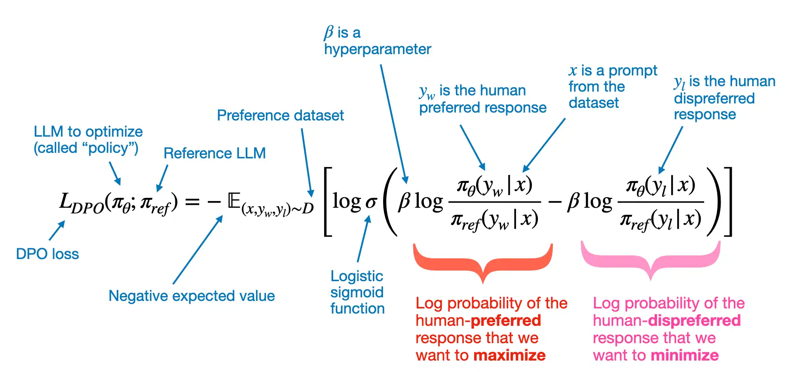

# 介绍
DPO主要解决LLM输出答案不一致的问题，例如给定prompt："hi！" 模型回复有时候会："hi！"有时候会："我是AI，很高兴认识你！"，可以看到两种风格回复都是对的，但是作为模型的定义者，我更喜欢第一种回复，因为语言简练，因此此次训练的目标就变成了在如何不降低模型回复能力的情况下，让风格一致，即每次都是这样简练的正确回答。
当然，如果模型回答明显错误，例如："看到了!",也可以直接选定错误的输出作为DPO的rejected回答进行优化。
事实上，对于以下几种情况都可以构造DPO训练：
> 1. 风格选择，如上面的举例
> 2. 答案优化，避免错误和不相关的答案，即可以自己构造rejected数据，即使模型并没有在使用中输出过此种答案
> 3. 构造新答案或风格，推荐优先SFT，但如果一定要自己构造chosen也可以，但效果可能不佳，例如你想让模型学会使用"out":"hi!" json去回答，但在之前的训练任务中从来没见过，因此可以自己构造chosen的json风格数据，但依旧建议先SFT。

以下是一些DPO的典型应用场景：
> 对话系统:<br>
> 在智能客服和聊天机器人应用中，根据用户反馈和偏好调整回复，使内容更贴合用户。<br>

> 内容生成与创作:<br>
> 文本生成：可优化新闻报道、小说创作、文案撰写等的文本，使其符合读者或编辑偏好；代码生成：根据开发者偏好精调代码生成模型。<br>

> 问答系统改进:<br>
> 在专业领域问答系统中，根据专家意见和用户反馈调整回答；在常见问题解答系统中，根据用户选择和评价优化回答策略。<br>

> 模型安全性提升:<br>
> 将安全、积极、正面回答作为偏好输出，避免生成有害内容；根据审核人员判断和偏好训练模型，提高信息安全性。<br>

> 个性化推荐系统:<br>
> 根据用户历史行为、偏好和反馈精调推荐模型，提供个性化推荐。<br>

## 目录说明
```shell
../dpo
../dpo/dpo.py           # DPO训练代码
../dpo/dpo_sampling.py  # DPO数据采样代码
```

## 公式释义
[](https://github.com/rasbt/LLMs-from-scratch/blob/main/ch07/04_preference-tuning-with-dpo/dpo-from-scratch.ipynb)
> note: 图片来自LLMs-from-scratch

# 数据相关
## 处理数据格式
这里依旧选择ShareGPT风格，数据示例链接见：[LLAMA-Factory Link](https://github.com/hiyouga/LLaMA-Factory/blob/main/data/dpo_en_demo.json)
```json
[
  {
    "conversations": [
      {
        "from": "human",
        "value": "human instruction"
      },
      {
        "from": "function_call",
        "value": "tool arguments"
      },
      {
        "from": "observation",
        "value": "tool result"
      },
      {
        "from": "gpt",
        "value": "model response"
      }
    ],
    "system": "system prompt (optional)",
    "tools": []
  }
]
```
## 数据采样
代码见../dpo/dpo_sampling.py, 针对目标任务构建了一些prompts，然后设置固定的temperature和top_k,top_p,
每个prompt运行10次，将所有的结果以Q:prompt,A[1],A[2]...A[10]存储为单独的文本，然后根据需求选择自己的chosen和rejected数据.


# 经验
训练数据建议：<br>
    比较专项的任务，例如让模型输出某种风格的输出：2～3k。<br>
    标准较清晰比较清晰的任务：5k ～ 1w。<br>
    标准十分复杂也不够清晰的任务：1w 条及以上，视整体任务难度而定。<br>
训练参数选择：<br>
epoch：模型训练轮数，通常选择 1～3 之间<br>
earning rate：学习率，LORA 训练选择 learning rate 通常 在 5e-6～1e-5。<br>
beta：通常在 0.1 到 0.5 之间<br>


# Refs
[1] [原论文->Direct Preference Optimization: Your Language Model is Secretly a Reward Model](https://arxiv.org/pdf/2305.18290) <br>
[2] [B站视频讲解:Link](https://www.bilibili.com/video/BV1eogkecE1N?spm_id_from=333.788.videopod.sections&vd_source=81da8e7b175ff37aecb83c53995499b5)<br>
[3] [SimPO论文是DPO的升级优化版->Simple Preference Optimization with a Reference-Free Reward](https://arxiv.org/pdf/2405.14734) <br>
[4] [Youtube 视频讲解，推荐 Link](https://www.youtube.com/watch?v=k2pD3k1485A&list=PLs8w1Cdi-zvYviYYw_V3qe6SINReGF5M-&index=4&ab_channel=Serrano.Academy) <br>
[5] [LLMs-from-scratch: 强烈推荐 Link](https://github.com/rasbt/LLMs-from-scratch/blob/main/ch07/04_preference-tuning-with-dpo/dpo-from-scratch.ipynb)<br>
[6] [火山引擎, 一些微调参考 Link](https://www.volcengine.com/docs/82379/1354009)