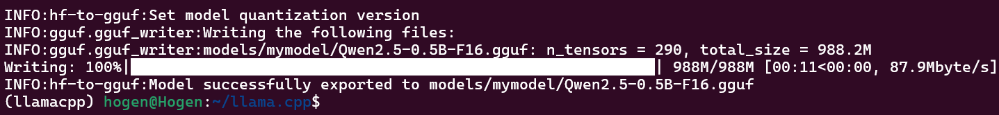

# Introduction
机器只有CPU建议通过这个这个库进行推理，性能不错，而且长期维护.

## Installation
如果没有cmake,安装下cmake工具,[CMake Link](https://cmake.org/download/).<br>
安装可以查看是否安装完成
```shell
cmake --version
# 如果显示右边为成功===> cmake version 3.31.2
```
下载llama.cpp进入目录
```shell
git clone https://github.com/ggerganov/llama.cpp
cd llama.cpp
```
编译
```shell
cmake -B build
cmake --build build --config Release

# 编译结束后的文件在llama.cpp/build/bin/Release/ 目录下
# 可以考虑加入到系统环境变量中, 其中
# llama.cli工具用于启动GGUF模型
# llama-quantize 用于量化模型
```
ubuntu可以通过homebrew安装llama工具套,如下：
```shell
# 安装brew
/bin/bash -c "$(curl -fsSL https://raw.githubusercontent.com/Homebrew/install/HEAD/install.sh)"

# 安装llama.cpp
brew install llama.cpp
```

进入llama.cpp目录
```shell
cd llama.cpp
# 安装环境需求
python3 -m pip install -r requirements.txt
```
拷贝所有模型相关和tokenizer相关到models/mymodels/下:
> generation_config.json  tokenizer.json         vocab.json
config.json            model.safetensors       tokenizer_config.json

转换至GGUF模型：
```shell
# convert the model to ggml FP16 format
python3 convert_hf_to_gguf.py models/mymodel/

# 也可以进一步量化为4bit，通过讲刚才得到的GGUF文件进行量化使用Q4_K_M
llama-quantize ./models/mymodel/Qwen2.5-0.5B-F16.gguf ./models/mymodel/Qwen2.5-0.5B-Q4_K_M.gguf Q4_K_M
```
转换过程如图：


转换后的体积如下，model.safetensors是基于Qwen底座的模型,量化后只有380M：
-rw-r--r-- 1 hogen hogen 949M Jan  7 21:58 Qwen2.5-0.5B-F16.gguf
-rw-r--r-- 1 hogen hogen 380M Jan  7 22:08 Qwen2.5-0.5B-Q4_K_M.gguf
-rwxr-xr-x 1 hogen hogen 943M Jan  7 21:57 model.safetensors

在命令行启动模型进行测试：
```shell
 llama-cli -m ./mymodel/Qwen2.5-0.5B-Q4_K_M.gguf -cnv -p "你是“小辣”，一个友好的智能助手！"
 
 # 也可以使用模版形式对话：
 llama-cli -m ./mymodel/Qwen2.5-0.5B-Q4_K_M.gguf -p "你是小辣，一个有用的助手！" -cnv --chat-template chatml
 
 # 也可以启动Server使用RestAPI访问：
llama-server -m Qwen2.5-0.5B-Q4_K_M.gguf --port 8080
```
效果如图：


测试REST接口代码如下：
```python
import asyncio
from openai import AsyncOpenAI
system = "你是“小辣”，一个友好的智能助手！"
async def myfun():
    try:
        client = AsyncOpenAI(
            api_key='ollama',
            # base_url="http://localhost:11434/v1",
            base_url = "http://127.0.0.1:8080/v1",
        )
        messages = []
        messages.append({"role": "system", "content": system})
        messages.extend([{"role": "user", "content": "hi, 你好"}])
        print(messages)

        streams = await client.chat.completions.create(
            # model="llama3.1",
            model="Qwen2.5-0.5B-Q4_K_M",
            messages=messages,
        )
        print(streams.choices[0].message.content)
    except Exception as e:
        print(e)

if __name__ == '__main__':
    asyncio.run(myfun())
```

# Refs
[1] [llama.cpp Github]()<br>
[2] [llama.cpp build docs](https://github.com/ggerganov/llama.cpp/blob/master/docs/build.md)<br>

