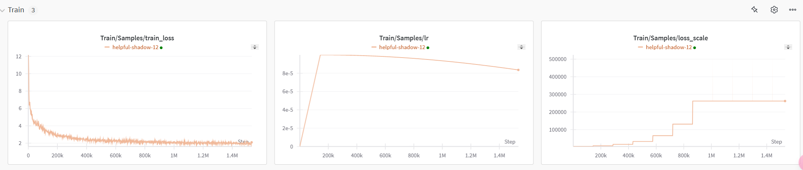

# Introduction
LLM预训练的目的是为了实质上是为了让模型开始构造词和词之间的基本的维度距离，从表现上看，就是让大模型完成词语接龙，这些接龙从表面上看可能无意义，因为模型在训练阶段，是不会补充上下文环境关系，而后续的补充上下文关系则需要使用SFT去构造。
DeepSpeed使用方法:[DeepSpeedGuide](deepspeed_guide.md)

## 机器配置
4090-24G GMQ(0.1B)训练
V100-32G GMQ(0.1B)训练
A100-80G LMQ(0.6B)训练

## 模型文件
LMQ是llama3.2的架构，对参数做了小修改，分词器使用了Qwen2.5的分词器 [ModelScope LMQ-0.6B Link](https://modelscope.cn/models/hogenzhu/LMQ-0.5B/summary)<br>

## 文件目录
> ./pretrain                        #当前目录<br>
> ./pretrain/hf_pretrain.py         #基于Huggingface，但上下文使用了拼接形式<br>
> ./pretrain/hf_pretrain_truncate.py    #基于Huggingface，但上下文使用了截断形式 <br>
> ./pretrain/hf_pretrain_truncate_eval.py # 基于Huggingface的API，测试文件<br>
> ./pretrain/torch_pretrain.py  # 基于原生pytorch <br>
> ./pretrain/deepspeed_pretrain.py # 基于DeepSpeed开发

## 数据格式
数据使用了jsonl的形式，每一行都是一条预训练数据,格式为{"Text":"content"}, 两条数据之间，使用特殊token <|endoftext|>进行分隔，这是GPT的方法，千问的训练也使用了这种方法，因此这里也选择了这种，LLAMA使用的是<s></s>作为分隔标记，看个人喜好自己处理就好.<br>
最大长度可以根据你开放的上下文长度来定义，如果上下文长度不够，可以使用padding填充的方法，既末尾全部使用<|endoftext|>进行填充，但需要注意的是，至少要在末尾保留一个<|endoftext|>用来告诉模型，一段关联的上下文结束了，同时可以考虑生成attention_mask,这样可以在计算loss的时候，把多于的<|endoftext|>的填充标记位置忽略掉，加快计算效率.<br>
除了填充，也可以使用拼接的方法，这样上下文之间只需要使用<|endoftext|>分隔即可。

## 演示数据
预训练数据仓库，可以自己写个转换函数转换：[seq-monkey-data中文通用文本开源数据集 Link](https://github.com/mobvoi/seq-monkey-data/blob/main/docs/pretrain_open_corpus.md)<br>
ModelScope，已经转换为jsonl格式，会更方便: [ModelScope Link](https://modelscope.cn/datasets/hogenzhu/LMQ/files)<br>


# Using
## 使用方法
选择一种你喜欢的方式，单机训练，启动方法如下:
```shell
python hf_pretrain.py
```
or
```shell
python hf_pretrain_truncate.py
```
or
```shell
python torch_pretrain.py
```
多卡多机训练见上方DeepSpeed方案链接.

## 训练过程
这里使用了wandb进行展示.[Wandb Link](https://wandb.ai)

可以看到两个批次效果如图.

## 测试
运行hf_pretrain_truncate_eval.py, 注意需要改对应选择的模型及权重路径
```shell
python hf_pretrain_truncate_eval.py
```

## 接龙效果
设置五个**中文**接龙词：'特朗普', '美国','中国','英国','人工智能是'<br>
Note: 因为语料中没有英文，因此不需要考虑英文接龙.
> 特朗普的新冠大计目标是“新冠大计”的目标，而对所有国家来说，都意味着在新冠疫情爆发之前，美国已经进入了“疫病”阶段。但美国民众仍然很担心。如果新冠大计的“灭顶”，美国疾病管控委员会将面临挑战。
如果疫情已经持续，美国政府已经确认死亡的可能“完全逆转”，也未发现。如果新冠病毒大计的“灭顶”，美国政府一直在计划与“疫病”联合开发

>美国航空、航天、导弹等国际航空和航天领域的企业或个人也争相加入。但这些航空和航天领域企业的高管们表示，目前正面临大规模商业化需求。
据路透社8日报道，航空、航天等高科技技术领域都纷纷加入航空供应链，与航空业密切相关，但目前尚不清楚它们各自的优势。
据报道，美国航空和航天领域企业高管们对这些航空制造商的反应，也似乎将“以航空为例”。
据路透社

> 中国民航管理干部学院自考报考条件
一、学历要求
1)具有中华人民共和国国籍，本科以上学历
(1)热爱铁路、交通管理方面的工作，具有较强的行政、服务意识。
(2)专业性强，能吃苦耐劳，热爱铁路、交通运输工作。
二、学历要求
1)学历要求
2)身体健康，能服从办公室安排，愿意继续学习相关教学计划。
2)学历符合下列条件：国家承认学历的社会组织和个人

> 英国伯明翰大学医学院的研究人员对来自全球90%的脑神经血管疾病患者展开筛查和治疗，为患者展开脑电图异常检查、诊断、病理评估，对脑电图异常进行筛查和辅助诊断，为患者的脑出血、脑挫裂、脑溢血患者寻找寻路的策略提供有力指导。英国伯明翰大学医学院于3月22日在该校医学院第三附属医院脑电图异常检查出有脑干硬化、

> 人工智能是计算机科学的起源，人工智能对于各行各业来说都是一种重要的工作，随着人工智能的不断发展，人工智能技术应用也越来越多。人工智能应用已开始在各行各业落地。

# Experiments
1. 可以参考deepspeed_guide.md过程.
2. 实际上建议使用开源预训练模型，因为预训练的语料在数量和质量都超过了本项目.
3. Batch尽量大一些，如果显存不够，就通过梯度累积模拟就好.

# Refs
[1] [LLMs-from-scratch](https://github.com/rasbt/LLMs-from-scratch)<br>
[2] [MiniMind 在B站有同款视频](https://github.com/jingyaogong/minimind/tree/master?tab=readme-ov-file)<br>