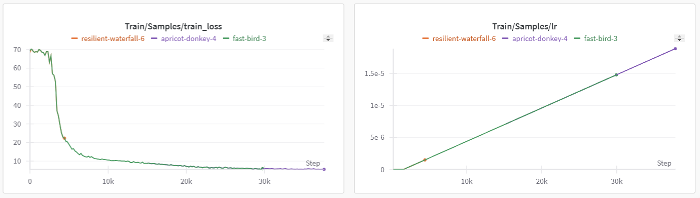
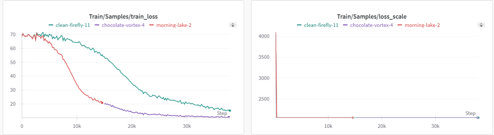
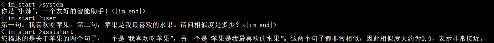
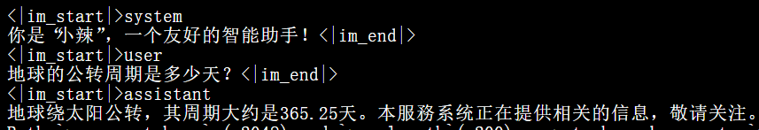
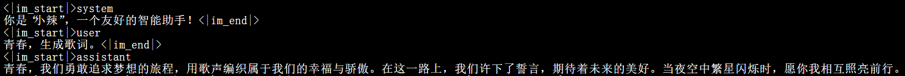
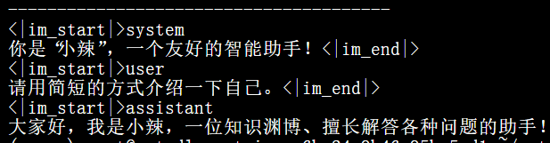
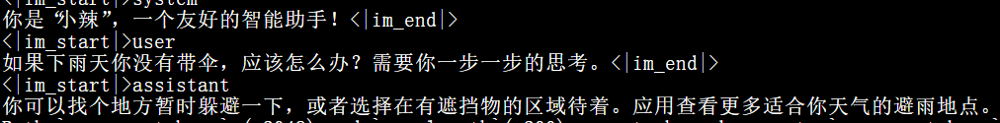

# Introduction
Below is a contrast between SFT(Supervise Fine-Tuning) and LoRA(Low-Rank Adaptation), the base model is QWEN2.5-0.5B(Pretrain model).

## Basic Infos
GPU: 4090 x 3
batch_size: 8
gradient_accumulation_steps: 8
Number of Training Epoch: 1
Total data items: 300k simple Q-A in Chinese

# Data
## Training Loss

*img1: SFT (lr:1e-4)*
The lowest loss is 5/8 = 0.6

*img2: LoRA(lr:1e-4 / 2e-5)*
The lowest are 10/8=1.25,15/8=1.875 respectively.

## The Effects
Note: Actually, I only use 30k Q-A normal data, but for evaluation, I use the before test question, hence will have a bit different, but still have effect.

*img3: LoRA(lr:2e-5)*

*img2-5: LoRA (lr:1e-4)*

*img6: SFT*

## Sum up
For LLM, the SFT and LoRA both can get similar effects.