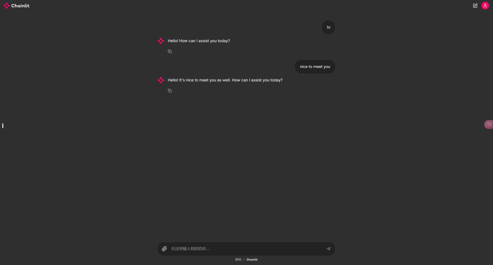

# Introduction
这里使用了Chainlit开源项目作为聊天界面

# Using
## Installation
```shell
pip install chainlit

# only this version can be run for chainlit
pip install pydantic==2.10.1
```

## Quick Using
```shell
chainlit run web_ui.py -w
```
参数-w 是让工具自动检测代码更改进行热重载
默认8000端口，如果要更改不同端口，请使用--port $,eg:
```shell
chainlit run web_ui.py -w --port 6584
```

## Effects


# Refs
[1] [Chainlit Cookbook](https://github.com/Chainlit/cookbook)<br>
[2] [Chainlit Docs](https://docs.chainlit.io/examples/cookbook)<br>
[3] [llms-from-scratch example](https://github.com/rasbt/LLMs-from-scratch/blob/main/ch05/06_user_interface/README.md)<br>
